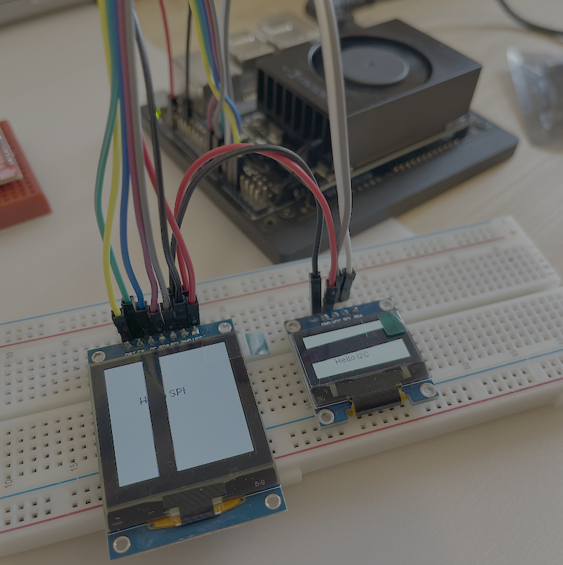

# Jetson Orin Nano OLED

The code to display content on these small SPI and I2C OLEDs is quite simple. In the case of the I2C display, it should work with little effort. The complexities come when attempting to use GPIO pins for some of the additional pins required by SPI such as the reset (RST) and data command (DC) pins. **The Jetson Orin Nano does not enable these for output by default**, and this can not be changed by the `Jetson.GPIO` python module. Really this whole repo is a learning exercise in how to work with the 40 pin header, and documenting it so I don't forget how to do it next time.

Ignore those black lines, they only show in photos

## Background
Strongly recommend watching the [Jetson Hacks video on using GPIO pins](https://www.youtube.com/watch?v=a8espzPAzu4) and looking through the [associated repo](https://github.com/jetsonhacks/jetson-orin-gpio-patch). This does work for enabling GPIO pns; the issue I had is using this device tree source (dts) file disabled all other pins that weren't included such as the SPI and I2C pins.

## Hardware setup
Both displays are cheap OLEDs sourced from AliExpress; commonly referred to as 7-pin (SPI) and 4-pin (I2C). Here I've used a 128x128px SPI OLED with a SH1107 driver chip and a 128x64px I2C OLED with a SSD1306 driver. The Luma OLED library using in this repo supports a large variety of these displays, so while some code changes may be needed, they are quite simple to do. Similarly the pin labels on these cheap OLEDs do vary somewhat, so some interpretation may be required when using the below hookup diagram. There's no dependency on having both displays either, so feel free to leave one out.

## Updating the device tree

### Disclaimer
You can potentially mess things up, so follow with caution and don't assume any of the below will be ok. My worst case scenario was having to reflash via the SDKManager again, but it never came to that.

The following was carried out on a Jetson Orin Nano Dev Kit 8GB running JetPack 6.2.

### Generating a Device Tree Source File (DTS) - optional

I've included the dts file used in the `./jetson` folder, so this step can be skipped. This however may be useful in the future or for different devices.

There's an Excel spreadsheet provided by NVIDIA that uses macros to generate dts files. That would be the approved way of doing this, I found the files it generated to be somewhat different to those used in the Jetson Hacks tutorial so opted for a different approach.

I started by using the `dtc` tool to generate a source version of the blob version included in the distribution.

First find the device tree blob that configures the 40 pin header

    ls -al /boot/ | grep hdr40

In this case we use the `tegra234-p3767-0000+p3509-a02-hdr40.dtbo` file as it's for the Orin Nano Dev Kit. The other one listed is for the Orin AGX/Orin NX. Convert into a dts file (something we can edit) with.

    dtc -I dtb -O dts -o /user/lachlan/my_dt.dts /boot/tegra234-p3767-0000+p3509-a02-hdr40.dtbo

By default all I2C, UART, SPI, etc are enabled. It's only enabling output on some GPIO pins that we want to change, so edits are limited to including a `overlay-name` (this shows in the jetson-io.py tool) and updating GPIO pins. The modified version I used can be found [here](./jetson/hdr4-gpio-spi-i2c.dts)

To give one example of the GPIO modification. The following was generated by the above

    hdr40-pin29 {
        nvidia,pins = "soc_gpio32_pq5";
        nvidia,function = "extperiph3";
        nvidia,pin-group = "extperiph3_clk";
        nvidia,pull = <0x00>;
        nvidia,tristate = <0x00>;
        nvidia,enable-input = <0x00>;
        nvidia,io-high-voltage = <0x00>;
        nvidia,lpdr = <0x00>;
    };

Which was changed to that below. The key change being `nvidia,enable-input = <0x1>;` which enables input and output from the pin.

    hdr40-pin29 {
        nvidia,pins = "soc_gpio32_pq5";
        nvidia,tristate = <0x0>;
        nvidia,enable-input = <0x1>;
        nvidia,pull = <0x0>;
    };

If you'd like to understand what any of this is about, please watch that Jetson Hacks video.

### Setting the Device Tree Source File (DTS)

Compile the dts file

    dtc -O dtb -o hdr4-gpio-spi-i2c.dtbo ./jetson/hdr4-gpio-spi-i2c.dts

Copy into `/boot`

    sudo cp hdr4-gpio-spi-i2c.dtbo /boot

Setup with the jetson-io.py tool

    sudo /opt/nvidia/jetson-io/jetson-io.py

An interactive tool will open up, just follow the prompts 'Configure Jetson 40pin Header' -> 'Configure for compatible hardware' -> 'GPIO, SPI and I2C' -> save and restart. Note: the "GPIO, SPI and I2C" name comes from the overlay name we include in the dts file, if you used a different name it will differ. If you happen to end up with two `.dtbo` files that use the same overlay name in `/boot` the tool will crash with no error message (ask me how I know!).

Once the Jetson has restarted move onto running the code.

## Running the display code

The following assumes Python (>3.10) and the uv package manager is installed.

To run the SPI test

    uv run oled-spi

To run the I2C test

    uv run oled-i2c

If all goes to plan you should see the above on your OLED displays

# Running the display code with Docker

The Dockerfile in this repo uses on of the [Jetson Containers](https://github.com/dusty-nv/jetson-containers) ROS images. It does so only because I plan in using ROS in a future project, there are absolutely better base images to start with. Unfortunately as a result of this uv doesn't play along particularly well, so some hacks are used below. It assumes Jetson Containers has been installed.

Build the docker image

    sudo docker build -t ros-oled-test .

Run the image. Note we run ths container as "privileged" without this flag access to GPIO wont work. This command will open a bash shell within the container.

    sudo jetson-containers run -v .:/app --privileged  ros-oled-test

To run the OLED tests within the container

    cd /app/src
    python -m jetson_orin_nano_oled.oled_spi
    python -m jetson_orin_nano_oled.oled_i2c

