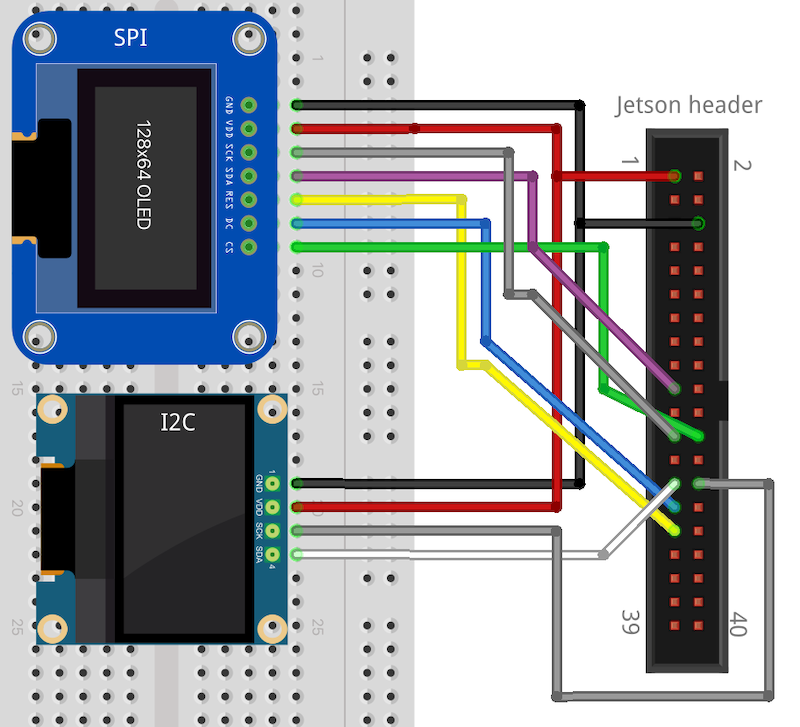

# Jetson Orin Nano OLED

The code to display content on these small SPI and I2C OLEDs is quite simple. In the case of the I2C display, it should work with little effort. The complexities come when attempting to use GPIO pins for some of the additional pins required by SPI such as the reset (RST) and data command (DC) pins. **The Jetson Orin Nano does not enable these for output by default**, and this can not be changed by the `Jetson.GPIO` python module. Really this whole repo is a learning exercise in how to work with the 40 pin header, and documenting it so I don't forget how to do it next time.

Ignore those black lines, they only show in photos

## Background
Strongly recommend watching the [Jetson Hacks video on using GPIO pins](https://www.youtube.com/watch?v=a8espzPAzu4) and looking through the [associated repo](https://github.com/jetsonhacks/jetson-orin-gpio-patch). This does work for enabling GPIO pns; the issue I had is using this device tree source (dts) file disabled all other pins that weren't included such as the SPI and I2C pins.

## Hardware setup

Both displays are cheap OLEDs sourced from AliExpress; commonly referred to as 7-pin (SPI) and 4-pin (I2C). Here I've used a 128x128px SPI OLED with a SH1107 driver chip and a 128x64px I2C OLED with a SSD1306 driver. The Luma OLED library using in this repo supports a large variety of these displays, so while some code changes may be needed, they are quite simple to do. Similarly the pin labels on these cheap OLEDs do vary somewhat, so some interpretation may be required when using the below hookup diagram.

